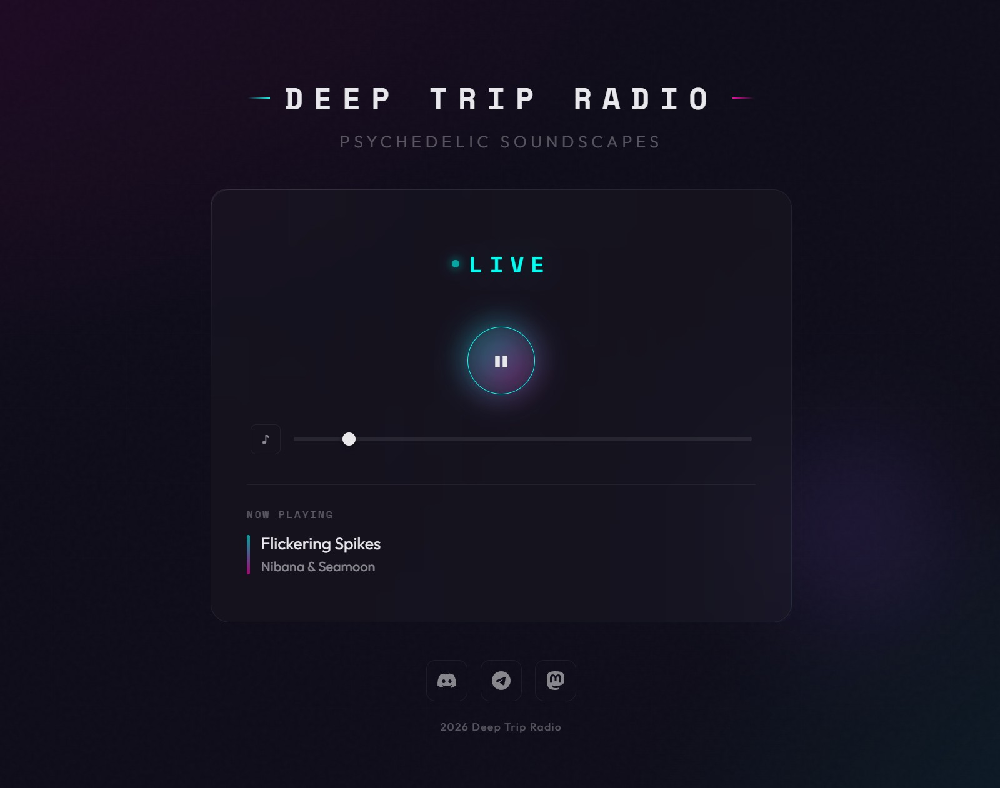

# Deep Trip Radio

**A 24/7 psychedelic and downtempo internet radio station, running live at [deeptripradio.net](https://deeptripradio.net/)**



Built as a vibe coding project with [Claude Code](https://claude.ai/code) by Anthropic.

---

## The Music

All music broadcast on Deep Trip Radio is sourced from [Ektoplazm](https://ektoplazm.com/) — a free music portal dedicated to psychedelic, progressive, and downtempo electronic music. All releases are licensed under **Creative Commons** and free for non-commercial use. Deep Trip Radio does not monetise its stream.

---

## Architecture

```
USB Drive (MP3s)
      │
      ▼
  ezstream  ──►  icecast2  ──►  cloudflared  ──►  Cloudflare Edge  ──►  Browser
      │              │
  playlist.m3u   :8000/live
  (shuffled)
```

- **Raspberry Pi Zero W** — hosts the entire radio stack
- **icecast2** — streaming media server, exposes `/live` mountpoint
- **ezstream** — reads shuffled playlist from USB, pushes MP3 stream to icecast via libshout
- **cloudflared** — Cloudflare Tunnel daemon; exposes the Pi's icecast publicly without port forwarding or static IP
- **Cloudflare Pages** — hosts the website (this repo's `website/` folder)
- **Cloudflare Tunnel** — streams audio and serves metadata at `stream.deeptripradio.net`

---

## Features

### Player (`website/assets/p.js`)
- Built on [Howler.js](https://howlerjs.com/) with `html5: true` for live streaming
- **Auto-reconnect** — exponential backoff (2s → 4s → 8s → 16s → 30s max, up to 20 attempts) on any stream drop
- **Stall detection** — polls `sound.seek()` every 5s; if `currentTime` freezes while supposedly playing, forces a reconnect. Catches silent connection deaths that Howler has no native callback for
- **Live metadata** — polls icecast's `/status-json.xsl` every 5s to display current track title and artist
- **Volume control** — slider + mute toggle, persisted in `localStorage`
- **Keyboard shortcut** — spacebar to play/pause
- **Error recovery** — clicking play after exhausting all reconnect attempts creates a fresh connection rather than requiring a page refresh

### Pi Stack (`pi/`)
- `start_radio.sh` — waits for USB mount, finds KINGSTON drive with MP3s, generates a shuffled playlist (excludes non-psychedelic genres), logs to `~/startup.log`
- `ezstream.xml` — ezstream config: connects to icecast on localhost, streams `/live` mountpoint as MP3
- `icecast.xml` — icecast2 config: CORS headers, burst buffer (262144 bytes ≈ 16s at 128kbps), 30s source timeout to survive inter-track pauses from USB reads
- `ezstream.service` — systemd unit with `Restart=always`; waits for playlist to be non-empty before starting (handles USB mount delay at boot)
- `wifi-power-save-disable.service` — disables WiFi power save mode at boot; prevents the Pi Zero W's brcmfmac chip from dozing between TCP ACKs, which caused intermittent DNS timeouts in cloudflared
- `dtr_monitor.sh` — optional diagnostics script; runs 6 parallel monitors (stream, tunnel, WiFi, system, network, cloudflared log tail) and writes to `~/dtr_monitor_data/`

---

## Setup

### Prerequisites
- Raspberry Pi (tested on Pi Zero W)
- icecast2: `sudo apt install icecast2`
- ezstream: `sudo apt install ezstream`
- cloudflared: [install from Cloudflare](https://developers.cloudflare.com/cloudflare-one/connections/connect-networks/downloads/)
- A Cloudflare account with a tunnel configured to point to `http://localhost:8000`

### Pi Setup

1. Copy `pi/icecast.xml` to `/etc/icecast2/icecast.xml` — replace `YOUR_ICECAST_PASSWORD` with your chosen password
2. Copy `pi/ezstream.xml` to `~/ezstream.xml` — replace `YOUR_ICECAST_PASSWORD` with the same password
3. Copy `pi/start_radio.sh` to `~/start_radio.sh` and make executable: `chmod +x ~/start_radio.sh`
4. Add `start_radio.sh` to cron or run at boot to generate the playlist before ezstream starts
5. Copy `pi/ezstream.service` to `/etc/systemd/system/ezstream.service`
6. Copy `pi/wifi-power-save-disable.service` to `/etc/systemd/system/wifi-power-save-disable.service`
7. Enable services:
   ```bash
   sudo systemctl daemon-reload
   sudo systemctl enable ezstream wifi-power-save-disable
   sudo systemctl start ezstream wifi-power-save-disable
   ```
8. Configure cloudflared tunnel to proxy `http://localhost:8000` and set `protocol: http2` in `~/.cloudflared/config.yml`

### Website Deployment

Deploy the `website/` folder to Cloudflare Pages (or any static host). No build step required — plain HTML/CSS/JS.

Update `STREAM_URL` and `METADATA_URL` in `website/assets/p.js` to match your Cloudflare tunnel hostname.

---

## Cloudflare Configuration

- **HTTP/3 (QUIC) disabled** — Speed → Optimization → Protocol Optimization → HTTP/3 (with QUIC) → Off. QUIC is unreliable for long-lived audio streams; browsers should use HTTP/2 (TCP).
- **Tunnel protocol: http2** — set in `~/.cloudflared/config.yml`. QUIC-based tunnels cause simultaneous 4-connection drops when router NAT expires idle UDP state.

---

## Diagnostics

`pi/dtr_monitor.sh` is a self-contained background monitor for the Pi:

```bash
bash dtr_monitor.sh start   # run in background
bash dtr_monitor.sh stop    # stop
bash dtr_monitor.sh status  # latest readings
bash dtr_monitor.sh report  # last 20 lines from all logs
```

Monitors: icecast listener count, cloudflared tunnel connections, WiFi signal/retries, CPU temp, ping/DNS latency, cloudflared log tail. Data written to `~/dtr_monitor_data/`, not wired into cron or systemd.

---

## Made with Claude Code

This project was built through vibe coding sessions with [Claude Code](https://claude.ai/code). The player logic, reconnect strategy, stall detection, Pi systemd services, Cloudflare tunnel configuration, WiFi optimisation, and diagnostics monitor were all developed and debugged collaboratively in the terminal.
